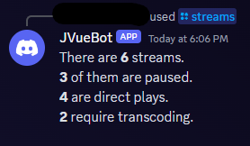
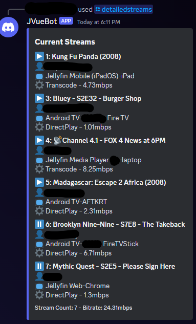
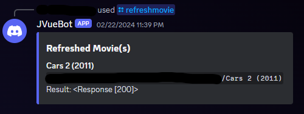
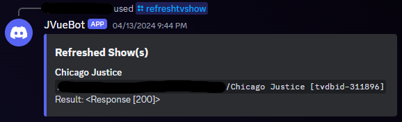

# JVueBot
Discord bot for interacting with your Jellyfin server.

## Quick and dirty instructions
//todo Actual install guide
// Assumes Jellyfin, Radarr, Sonarr, Autoscan installed.

1. Download the project and unzip into a folder
2. Rename the ```config.py.example``` to ```config.py```
3. Edit the variables in config for your environment.
4. Enter that folder in your terminal session
5. Run the command: ```docker image build -t jvuebot:0.0.10```
- NOTE: the name jvuebot is arbitrary, and the build number is arbitrary 
6. Now you have a docker image in your local repo, that you can use to run a container.
- ex. ```docker create --name=jvuebot --restart unless-stopped jvuebot:0.0.1```
- ex. ```docker start jvuebot``` 

NOTE: Whenever you want to change the configuration, you'll have to remove and rebuild the image/container. Will work on changing this to use editable environment variables in the future 

ex. ```docker stop jvuebot && docker rm jvuebot```

## JVueBot current commands

### /say
  - says the thing you wanted to say
### /hello
  - Says hello to you
### /runpolicyupdate
  - Runs your configured policy options against all users (minus exclusions)
  - Useful for applying a policy change like ```"LoginAttemptsBeforeLockout": 10'``` to all users
### /streams
  - Gives a summary of the current streams
  - ex. 
### /detailedstreams
  - Gives a detailed list of current streams
  - ex. 
### /refreshmovie
  - searches the text you give it against Radarr and then submits a refresh call to Autoscan for all results
  - ex. 
### /refreshtvshow
  - searches the text given against Sonarr and submits only the first result in an a API call to Autoscan
  - ex. 
